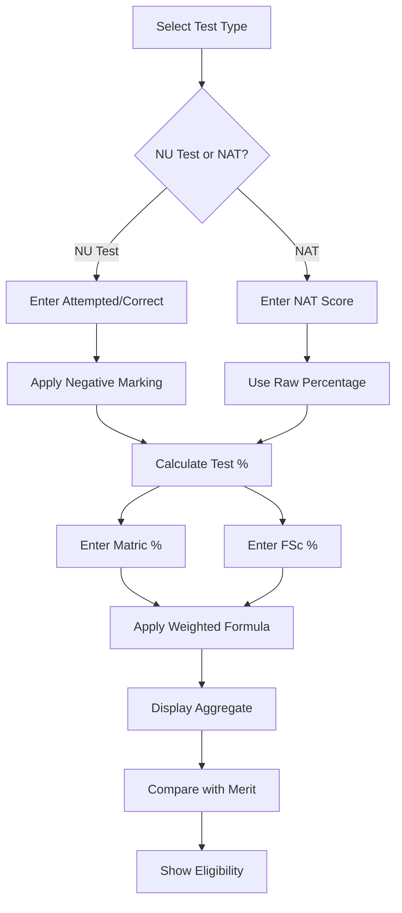

# 🚀 FAST NUCES Aggregate Calculator

<p align="center">
  
  
  
  
</p>

<div align="center">
  
  
  
  **The Ultimate Admission Probability Tool for FAST National University**
  
  [](https://your-deployment-link.com)
  [](https://github.com/yourusername/fast-aggregate-calculator/stargazers)
  [](https://github.com/yourusername/fast-aggregate-calculator/issues)
  
</div>

---

## 📋 Table of Contents
1. [✨ Overview](#-overview)
2. [🎨 Visual Preview](#-visual-preview)
3. [🚀 Key Features](#-key-features)
4. [📊 How It Works](#-how-it-works)
5. [🛠️ Installation & Usage](#️-installation--usage)
6. [🏗️ Architecture](#️-architecture)
7. [📁 Project Structure](#-project-structure)
8. [👥 Contributors](#-contributors)
9. [🤝 Contributing](#-contributing)
10. [📄 License](#-license)
11. [⚠️ Disclaimer](#️-disclaimer)

---

## ✨ Overview

<div align="center">
  
  | Aspect | Description |
  |--------|-------------|
  | 🎯 **Purpose** | Calculate admission aggregate for FAST NUCES |
  | 🎓 **Target Users** | Prospective FAST university students |
  | 📱 **Platform** | Web Application (Responsive) |
  | 🎨 **UI Framework** | Modern CSS + JavaScript |
  | 🌈 **Themes** | Light & Dark Mode |
  
</div>

The **FAST NUCES Aggregate Calculator** is a comprehensive web-based tool designed to help prospective students accurately estimate their admission chances for various programs across all FAST campuses. Whether you're applying with **NU Test** or **NAT marks**, this tool provides precise calculations, historical merit data, and valuable insights to guide your admission strategy.

---

## 🎨 Visual Preview

### 🖥️ Desktop Interface
```
┌─────────────────────────────────────────────────────────────┐
│ 🚀 FAST NUCES AGGREGATE CALCULATOR                          │
├─────────────────────────────────────────────────────────────┤
│ [🌗] [📊] [📱]                                              │
├─────────────────────────────────────────────────────────────┤
│  ░░░░░░░░░░░░░░░░░░░░░░░░░░░░░░░░░░░░░░░░░░░░░░░░░░░░░░░░  │
│  ░░██████╗░░███████╗░░██████╗░████████╗░░██████╗░░░░░░░░░  │
│  ░░██╔══██╗░██╔════╝░██╔════╝░╚══██╔══╝░██╔════╝░░░░░░░░░  │
│  ░░██████╔╝░█████╗░░░╚█████╗░░░░░██║░░░░╚█████╗░░░░░░░░░░  │
│  ░░██╔══██╗░██╔══╝░░░░╚═══██╗░░░░██║░░░░░╚═══██╗░░░░░░░░░  │
│  ░░██║░░██║░███████╗░██████╔╝░░░░██║░░░░██████╔╝░░░░░░░░░  │
│  ░░╚═╝░░╚═╝░╚══════╝░╚═════╝░░░░░╚═╝░░░░╚═════╝░░░░░░░░░░  │
│  ░░░░░░░░░░░░░░░░░░░░░░░░░░░░░░░░░░░░░░░░░░░░░░░░░░░░░░░░  │
│                                                             │
│  [📝] NU Test Calculator   [🎯] NAT Calculator             │
│  [📊] Merit Checker        [🖨️] Export Results             │
│                                                             │
│  👥 1,247 Students Used Today                              │
└─────────────────────────────────────────────────────────────┘
```

### 📱 Mobile Responsive Design
```
┌─────────────────────┐
│ 📱 FAST CALCULATOR  │
├─────────────────────┤
│ ☰ ≡ ≡ ≡ ≡ ≡ ≡ ≡ ≡ ≡ │
├─────────────────────┤
│                    ⇅ │
│  [NU] [NAT]         │
│                    ⇅ │
│  📊 Matric: ___%    │
│  📚 FSc: ___%       │
│  🧠 Test: ___%      │
│                    ⇅ │
│  🎯 Aggregate: 75%  │
│  ✅ Eligible: CS    │
│  ⚠️ Borderline: SE  │
│                    ⇅ │
│  [📥 PDF] [📷 PNG]  │
└─────────────────────┘
```

### 🌈 Theme Toggle Preview
| Light Mode | Dark Mode |
|------------|-----------|
|  |  |

---

## 🚀 Key Features

### 🧮 **Dual Calculator System**
<details>
<summary><b>📊 NAT Marks Calculator</b></summary>

```javascript
// Sample calculation logic
const calculateNATAggregate = (matric, fsc, nat, program) => {
  const weights = {
    computing: { matric: 0.10, fsc: 0.50, nat: 0.40 },
    engineering: { matric: 0.10, fsc: 0.60, nat: 0.30 }
  };
  // Precision calculation with rounding
  return (matric*weights[program].matric + 
          fsc*weights[program].fsc + 
          nat*weights[program].nat).toFixed(2);
};
```
- ✅ **Program-specific weightage** (Computing vs Engineering)
- ✅ **Real-time validation** of percentage ranges
- ✅ **Detailed breakdown** of each component's contribution
</details>

<details>
<summary><b>🧠 NU Test Calculator</b></summary>

```javascript
// NU Test with negative marking
const calculateNUScore = (attempted, correct, totalQuestions) => {
  const wrong = attempted - correct;
  const netScore = correct - (wrong * 0.25); // 0.25 negative marking
  return Math.max(0, (netScore / totalQuestions) * 100);
};
```
- ✅ **Negative marking** (0.25 per wrong answer)
- ✅ **Attempt tracking** with visual indicators
- ✅ **Score estimation** before actual results
</details>

### 🏫 **Campus & Program Intelligence**
<table>
<tr>
<th>Campus</th>
<th>Programs</th>
<th>Last Year Merit</th>
</tr>
<tr>
<td></td>
<td>CS, SE, EE, AI</td>
<td>76% - 84%</td>
</tr>
<tr>
<td></td>
<td>CS, SE, BBA, AI</td>
<td>74% - 82%</td>
</tr>
<tr>
<td></td>
<td>CS, SE, Cyber</td>
<td>72% - 80%</td>
</tr>
<tr>
<td></td>
<td>CS, SE</td>
<td>70% - 78%</td>
</tr>
<tr>
<td></td>
<td>CS, SE</td>
<td>68% - 76%</td>
</tr>
</table>

### 🖨️ **Export & Share Capabilities**
```
Export Options:
├── 📄 PDF Report (Detailed)
│   ├── Student Information
│   ├── Score Breakdown
│   ├── Eligibility Chart
│   └── Recommendations
├── 🖼️ Screenshot (Quick Share)
│   ├── Custom Watermark
│   ├── Date Stamped
│   └── Optimized Size
└── 📋 Clipboard Copy
    ├── Formatted Text
    └── Markdown Ready
```

### 🌗 **Smart Theme System**
```css
:root {
  /* Light Theme */
  --primary: #2563eb;
  --background: #ffffff;
  --text: #1f2937;
}

[data-theme="dark"] {
  /* Dark Theme */
  --primary: #3b82f6;
  --background: #0f172a;
  --text: #f1f5f9;
}
```
- ✅ **Auto-detection** of system preference
- ✅ **Persistent** theme selection
- ✅ **Smooth transitions** between themes

### 📊 **Real-time Analytics Dashboard**
```javascript
// Live view counter
const updateViewCounter = () => {
  const views = localStorage.getItem('fast_calculator_views') || 0;
  const newViews = parseInt(views) + 1;
  localStorage.setItem('fast_calculator_views', newViews);
  displayCounter(newViews);
};
```
- ✅ **Live counter** of total users
- ✅ **Anonymous analytics** for feature improvement
- ✅ **Feedback system** with sentiment analysis

---

## 📊 How It Works

### 📈 Calculation Formula


### 🎯 Weightage Distribution
```
For Computing Programs:
├── Matric/O-Levels: 10%
├── FSc/A-Levels: 50%
└── Admission Test: 40%

For Engineering Programs:
├── Matric/O-Levels: 10%
├── FSc/A-Levels: 60%
└── Admission Test: 30%
```

### 📊 Result Interpretation
| Aggregate Range | Admission Probability | Color Code |
|----------------|----------------------|------------|
| 85%+ | 🟢 **Very High** | `#10B981` |
| 75%-85% | 🟡 **High** | `#F59E0B` |
| 65%-75% | 🟠 **Moderate** | `#F97316` |
| 55%-65% | 🔴 **Low** | `#EF4444` |
| <55% | ⚫ **Very Low** | `#6B7280` |

---

## 🛠️ Installation & Usage

### 🚀 Quick Start (Local Development)
```bash
# Clone the repository
git clone https://github.com/yourusername/fast-aggregate-calculator.git

# Navigate to project directory
cd fast-aggregate-calculator

# Install dependencies (if any)
npm install  # or yarn install

# Start development server
npm start    # or yarn start

# Open in browser
# http://localhost:3000
```

### 📦 Deployment Options
```bash
# Deploy to Vercel
vercel deploy

# Deploy to Netlify
netlify deploy

# Deploy to GitHub Pages
npm run deploy
```

### 🎮 User Guide
1. **Select your test type** (NU Test or NAT)
2. **Enter your academic scores** with validation
3. **Choose your preferred program** (CS, SE, EE, etc.)
4. **View calculated aggregate** with color coding
5. **Check campus eligibility** based on last year merit
6. **Export results** as PDF or image for reference

---

## 🏗️ Architecture

### 🏛️ System Architecture
```
┌─────────────────────────────────────────────────────┐
│                   Frontend Layer                     │
├─────────────────────────────────────────────────────┤
│  • HTML5 / CSS3 / JavaScript (ES6+)                  │
│  • Responsive Design (Mobile First)                 │
│  • PWA Capabilities                                 │
│  • Local Storage for Persistence                    │
└─────────────────────────────────────────────────────┘
                            │
┌─────────────────────────────────────────────────────┐
│                  Business Logic                      │
├─────────────────────────────────────────────────────┤
│  • Aggregate Calculation Engine                      │
│  • Merit Comparison Algorithm                        │
│  • Eligibility Checker                               │
│  • Data Validation & Sanitization                   │
└─────────────────────────────────────────────────────┘
                            │
┌─────────────────────────────────────────────────────┐
│                    Data Layer                        │
├─────────────────────────────────────────────────────┤
│  • Merit History Database (JSON)                    │
│  • Program Requirements                             │
│  • User Preferences                                 │
│  • Analytics Data                                   │
└─────────────────────────────────────────────────────┘
```

### 🎨 UI Component Structure
```javascript
// Component Hierarchy
Root
├── Header
│   ├── Logo
│   ├── Theme Toggle
│   └── View Counter
├── Main Calculator
│   ├── Test Type Selector
│   ├── Score Input Forms
│   ├── Program Selector
│   └── Calculate Button
├── Results Panel
│   ├── Aggregate Display
│   ├── Campus Eligibility
│   ├── Merit Comparison
│   └── Export Options
├── Merit History Table
└── Footer
    ├── Feedback Form
    └── Disclaimer
```

---

## 📁 Project Structure
```
fast-aggregate-calculator/
├── 📂 assets/
│   ├── 📁 icons/          # SVG icons and logos
│   ├── 📁 images/         # Screenshots and banners
│   └── 📁 fonts/          # Custom typography
├── 📂 css/
│   ├── main.css          # Core styles
│   ├── themes.css        # Light/Dark themes
│   ├── responsive.css    # Mobile adaptations
│   └── animations.css    # UI animations
├── 📂 js/
│   ├── calculator.js     # Main calculation logic
│   ├── merit-data.js     # Campus merit data
│   ├── export.js         # PDF/Image export
│   ├── theme.js          # Theme management
│   └── analytics.js      # View counter & feedback
├── 📂 data/
│   ├── campuses.json     # Campus information
│   ├── programs.json     # Program details
│   └── merit-history.json # Past merit trends
├── 📂 docs/
│   ├── api.md           # If applicable
│   └── contribution.md  # Development guide
├── index.html           # Main entry point
├── README.md           # This file
├── LICENSE             # MIT License
└── package.json        # Dependencies (if any)
```

---

## 👥 Contributors

<table>
<tr>
<td align="center">
<a href="https://github.com/arifali">

<br />
<sub><b>Arif Ali</b></sub>
<br />
<sub>Lead Developer</sub>
</a>
</td>
<td align="center">
<a href="https://github.com/sohaibkamran">

<br />
<sub><b>Sohaib Kamran</b></sub>
<br />
<sub>UI/UX Designer</sub>
</a>
</td>
</tr>
</table>

### 🏆 Contribution Highlights
```diff
+ v1.0.0 Initial Release - Basic Calculator
+ v1.5.0 Added NAT Support & Campus Data
+ v2.0.0 Complete UI Overhaul & Export Features
! v2.1.0 Planned - Mobile App & API Integration
```

---

## 🤝 Contributing

We welcome contributions! Here's how you can help:

### 🐛 Reporting Issues
1. Check if the issue already exists
2. Use the issue template
3. Provide clear steps to reproduce
4. Include screenshots if applicable

### 💡 Feature Requests
1. Describe the feature clearly
2. Explain the use case
3. Suggest implementation if possible

### 🔧 Development Process
```bash
# 1. Fork the repository
# 2. Create a feature branch
git checkout -b feature/AmazingFeature

# 3. Commit your changes
git commit -m 'Add some AmazingFeature'

# 4. Push to the branch
git push origin feature/AmazingFeature

# 5. Open a Pull Request
```

### 📋 Coding Standards
- Use semantic HTML5
- Follow BEM naming convention for CSS
- Write clean, commented JavaScript
- Test across browsers (Chrome, Firefox, Safari)
- Ensure mobile responsiveness

---

## 📄 License

This project is licensed under the MIT License - see the [LICENSE](LICENSE) file for details.

```
MIT License

Copyright (c) 2024 Arif Ali & Sohaib Kamran

Permission is hereby granted, free of charge, to any person obtaining a copy
of this software and associated documentation files (the "Software"), to deal
in the Software without restriction, including without limitation the rights
to use, copy, modify, merge, publish, distribute, sublicense, and/or sell
copies of the Software, and to permit persons to whom the Software is
furnished to do so, subject to the following conditions:

The above copyright notice and this permission notice shall be included in all
copies or substantial portions of the Software.
```

---

## ⚠️ Disclaimer

<div align="center" style="background: #fee; padding: 15px; border-radius: 8px; border-left: 4px solid #f33; margin: 20px 0;">

**⚠️ IMPORTANT LEGAL NOTICE**

</div>

### 🔒 Official Status
```diff
- This is NOT an official FAST NUCES tool
- This is a third-party community project
- Calculations are estimates only
- Always verify with official sources
```

### 📢 Accuracy Notice
> **Note:** While we strive for accuracy, admission criteria may change. This tool uses historical data and publicly available formulas. The university's admission committee has the final authority on all admission decisions.

### 🔗 Official Resources
For official information, please visit:
- [FAST NUCES Official Website](https://www.nu.edu.pk)
- [Admission Office Contact](https://www.nu.edu.pk/Admissions)
- [University Prospectus](https://www.nu.edu.pk/Downloads)

### 📊 Data Sources
- Last year's merit data from public sources
- Formula based on official admission policies
- Regular updates based on user feedback

---

<div align="center">

## 🌟 Support the Project

If you find this tool helpful, please give it a ⭐ on GitHub!

[](https://star-history.com/#yourusername/fast-aggregate-calculator&Date)

### 📬 Connect With Us
[](https://twitter.com)
[](https://linkedin.com)
[](https://github.com)

**Made with ❤️ for Pakistani Students**

*Helping you navigate your academic journey since 2024*

</div>
